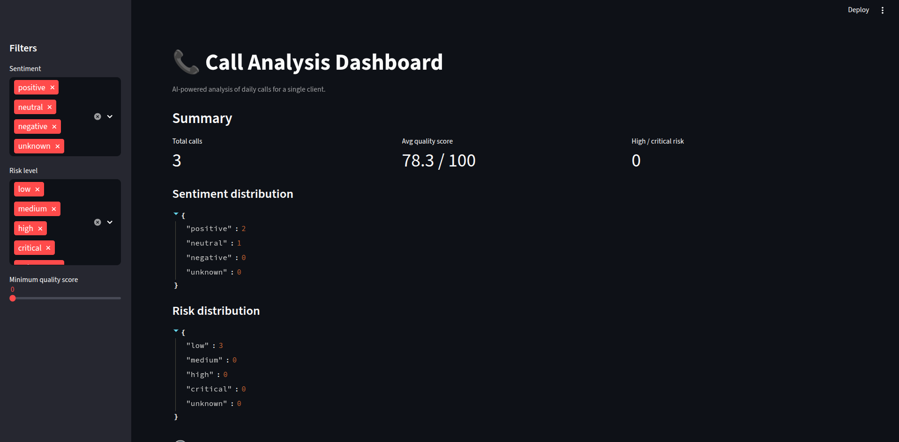
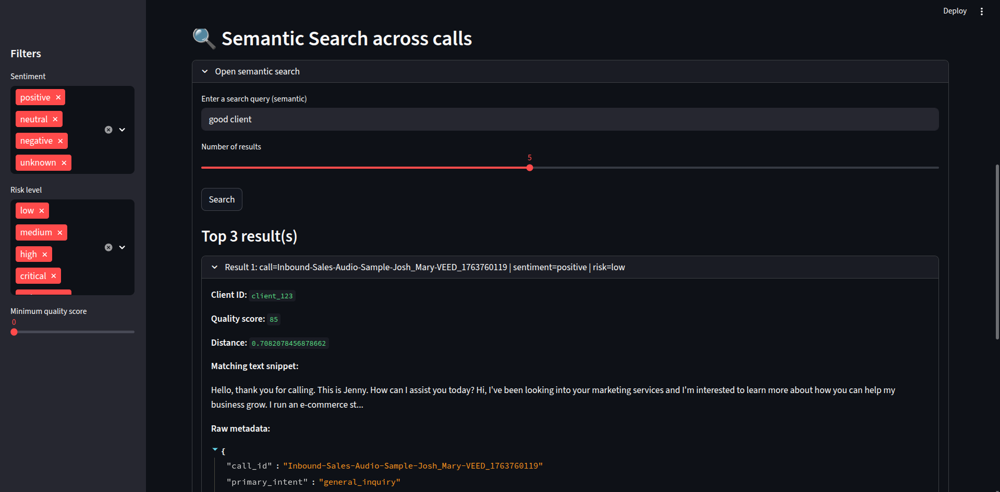
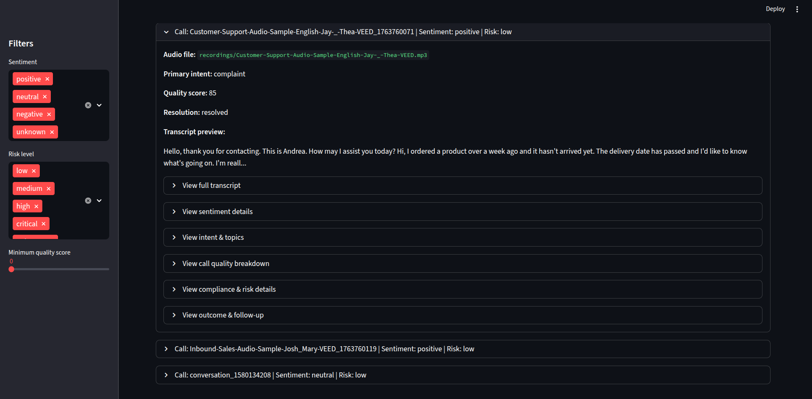

# 📞 AI Call Analysis Pipeline

AI-powered pipeline that ingests call recordings for a **single client**, runs multi-step LLM analysis on each call, indexes transcripts into a vector database, and exposes everything in a **Streamlit dashboard + semantic search**.

The pipeline currently works on `.wav` and `.mp3` files that you drop into a folder and is built in small, composable steps so it’s easy to extend.

---

## 🚀 What this project does

For each call, the system:

1. Discovers audio files in `recordings/` (`.wav` and `.mp3`).
2. Transcribes them with **OpenAI Whisper**.
3. Builds a rich `CallAnalysis` object (Pydantic) and saves it as JSON under `data/calls/`.
4. Runs multiple **LLM analysis passes** (via GPT-4o + LangChain):
   - Sentiment & emotion
   - Intent & topics
   - Call quality & agent performance
   - Compliance & risk
   - Outcome & follow-up
5. Indexes all transcripts into **ChromaDB** using **OpenAI embeddings**.
6. Lets you:
   - Explore calls and metrics in a **Streamlit dashboard**
   - Run **semantic search across calls** (CLI + UI)

---

## ✨ Features

### Per-call processing

For each audio recording:

1. **Ingestion**
   - Automatically discovers `.wav` and `.mp3` files in `recordings/` (recursively).
   - Creates a `RecordingFile` object with path, size, and modified time.

2. **Transcription (OpenAI Whisper)**
   - Uses `whisper-1` via the OpenAI API.
   - Produces a text transcript + optional detected language.

3. **Structured Call Object (Pydantic)**
   - Wraps each call as a `CallAnalysis` object with:
     - `metadata` (`CallMetadata`): call_id, client_id, audio file path, timestamps & extra metadata.
     - `transcript`: full text transcript.
     - `sentiment`: sentiment & emotion analysis.
     - `intent_and_topics`: main intent + topics.
     - `call_quality`: quality & agent performance.
     - `compliance_and_risk`: compliance flags & risk level.
     - `outcome_and_followup`: resolution status & follow-up actions.
     - `custom_metrics`: reserved for future business KPIs.
     - `raw_llm_outputs`: raw JSON from LLM calls for debugging.

4. **Per-call analysis (LLM, via OpenAI + LangChain)**

Each analyzed call gets:

- **Sentiment & emotion** (`SentimentAnalysis`)
  - Overall sentiment (`positive | neutral | negative`)
  - Numeric score (-1.0 to +1.0)
  - Emotion tags
  - Sentiment timeline over segments.

- **Intent & topics** (`IntentTopicsAnalysis`)
  - Primary/secondary intents
  - Topics and key phrases
  - Confidence score and notes.

- **Call quality & agent performance** (`CallQualityAnalysis`)
  - Overall quality score (0–100)
  - Subscores (greeting, empathy, clarity, professionalism, script adherence)
  - Strengths & improvement suggestions.

- **Compliance & risk** (`ComplianceRiskAnalysis`)
  - Required phrases present / missing
  - Forbidden phrases detected
  - PII detections with masked values
  - Risk level (`low | medium | high | critical`).

- **Outcome & follow-up** (`OutcomeFollowupAnalysis`)
  - Resolution status (`resolved | partially_resolved | unresolved`)
  - Final outcome label (e.g. `appointment_booked`, `information_provided`, `no_clear_outcome`)
  - Follow-up actions (description, owner, due date)
  - Escalation flag & reason.

All data is stored as JSON under `data/calls/`, one file per call.

---

## 🧠 Semantic search (ChromaDB + OpenAI)

The project includes a vector store layer for **semantic search across calls**:

- Uses **ChromaDB** as the persistent vector database (`chroma_db/`).
- Uses **OpenAI embeddings** (`text-embedding-3-small` by default) via Chroma’s `OpenAIEmbeddingFunction`.
- One document per call (full transcript), with metadata:
  - `call_id`, `client_id`, `audio_file`
  - `sentiment`, `primary_intent`, `risk_level`, `quality_score`

### Build the index

```bash
uv run python run_build_index.py
````

This:

* Loads all `data/calls/*.json`
* Extracts transcripts + metadata
* Upserts them into the `calls` collection in ChromaDB

### CLI search

```bash
uv run python run_search_cli.py "angry customer asking about refund"
```

This prints the top matching calls, including:

* `call_id`, `client_id`
* `sentiment`, `primary_intent`, `risk_level`, `quality_score`
* A text snippet of the matching part of the transcript
* Distance score

### Streamlit semantic search

The dashboard includes a **“🔍 Semantic Search across calls”** section:

* Enter a natural language query.
* View top-N matching calls with metadata and transcript snippets.
* Great for quickly finding:

  * Frustrated customers about billing
  * Calls about cancellations
  * Upsell opportunities
  * High-risk or high-impact conversations

---

## 🧱 Tech Stack

* **Language:** Python
* **Package manager:** `uv`
* **LLM & ASR:** OpenAI (Whisper, GPT-4o)
* **Orchestration / prompting:** LangChain (`langchain-openai`)
* **Vector DB:** ChromaDB (`chromadb` + `OpenAIEmbeddingFunction`)
* **Web UI:** Streamlit
* **Config:** YAML + environment variables
* **Data modeling:** Pydantic v2 models

---

## 📂 Project Structure

```text
call_analysis_pipeline/
├── app/
│   ├── __init__.py
│   ├── ingestion.py            # Discover audio recordings (.wav / .mp3)
│   ├── transcription.py        # Whisper transcription (OpenAI)
│   ├── storage.py              # Save CallAnalysis JSON files
│   ├── schemas.py              # Pydantic models (CallMetadata, CallAnalysis, etc.)
│   ├── analysis_sentiment.py   # Sentiment & emotion analysis
│   ├── analysis_intent_topics.py
│   ├── analysis_quality.py
│   ├── analysis_compliance.py
│   ├── analysis_outcome.py
│   ├── analysis_runner.py      # Helpers to run analyses over all calls
│   ├── vectorstore.py          # ChromaDB + OpenAI embeddings (index + search)
│   └── dashboard.py            # Streamlit dashboard (summary + filters + semantic search)
├── config/
│   └── config.example.yaml     # Example config (copy to config.yaml locally)
├── recordings/                 # Input .wav/.mp3 recordings (ignored in git)
├── data/
│   └── calls/                  # Per-call JSON outputs (ignored in git)
├── chroma_db/                  # ChromaDB storage (ignored in git)
├── run_full_pipeline.py        # End-to-end pipeline runner (audio → analysis → index)
├── run_build_index.py          # Build/update Chroma index over calls
├── run_search_cli.py           # Simple CLI semantic search tool
├── main.py                     # Ingest + transcribe + save CallAnalysis
├── pyproject.toml              # uv / project configuration
├── .gitignore
└── README.md
```

---

## ⚙️ Setup

### 1. Clone the repo

```bash
git clone <your-repo-url> call_analysis_pipeline
cd call_analysis_pipeline
```

### 2. Install dependencies with `uv`

```bash
uv sync
```

This uses `pyproject.toml` to install all dependencies into a virtual environment.

### 3. Configure OpenAI

Set your OpenAI API key as an environment variable (for the current shell session):

```bash
export OPENAI_API_KEY="sk-..."
```

Create your config file:

```bash
cp config/config.example.yaml config/config.yaml
```

Adjust values inside `config/config.yaml` as needed:

```yaml
client_id: "client_123"

recordings_dir: "recordings/"
data_dir: "data/"
chroma_db_dir: "chroma_db/"

openai:
  api_key_env: "OPENAI_API_KEY"
  whisper_model: "whisper-1"
  llm_model: "gpt-4o"
  embedding_model: "text-embedding-3-small"

compliance:
  required_phrases:
    - "This call may be recorded for quality and training purposes."
  forbidden_phrases:
    - "I guarantee you will never have any problems."
```

---

## 🔁 Pipeline: From audio to analyzed + indexed calls

### 0. Drop audio recordings

Place your `.wav` or `.mp3` files into:

```text
recordings/
```

Example:

```bash
cp /path/to/your_call.wav recordings/your_call.wav
```

### 1. Run the full pipeline

```bash
uv run python run_full_pipeline.py
```

This will:

1. Discover all `.wav` and `.mp3` files under `recordings/`.
2. Transcribe each with OpenAI Whisper.
3. Save one JSON per call in `data/calls/` as a `CallAnalysis` structure.
4. Run all analysis stages over all calls in `data/calls/`:

   * Sentiment & emotion
   * Intent & topics
   * Call quality
   * Compliance & risk
   * Outcome & follow-up
5. Optionally (if wired in) update the Chroma index over all calls.

Alternatively, you can explicitly rebuild the index with:

```bash
uv run python run_build_index.py
```

---

## 📊 Dashboard

### Run Streamlit

From the project root:

```bash
uv run streamlit run app/dashboard.py
```

Open the URL shown (typically `http://localhost:8501`).

### Dashboard features

* **Summary**

  * Total calls
  * Average quality score
  * High/critical risk count
  * Sentiment distribution
  * Risk distribution

* **Filters (sidebar)**

  * Sentiment (positive / neutral / negative / unknown)
  * Risk level (low / medium / high / critical / unknown)
  * Minimum quality score

* **Calls list**

  * Each call is shown in an expandable card with:

    * Call ID, sentiment, risk
    * Primary intent
    * Quality score
    * Resolution status
    * Transcript preview
  * Deeper details in nested expanders:

    * Full transcript
    * Sentiment details
    * Intent & topics
    * Call quality breakdown
    * Compliance & risk details
    * Outcome & follow-up

* **🔍 Semantic Search across calls**

  * Type a natural language query.
  * View top-N semantically similar calls from the Chroma index.
  * See matching snippets + metadata (sentiment, risk, quality, etc.).

---

## ✅ Current Status

Implemented end-to-end:

* [x] Ingestion of `.wav` and `.mp3` files
* [x] Transcription via OpenAI Whisper
* [x] Structured `CallAnalysis` Pydantic models
* [x] Sentiment & emotion analysis
* [x] Intent & topics analysis
* [x] Call quality scoring
* [x] Compliance & risk checks
* [x] Outcome & follow-up analysis
* [x] JSON storage per call under `data/calls/`
* [x] ChromaDB index over transcripts (OpenAI embeddings)
* [x] CLI semantic search (`run_search_cli.py`)
* [x] Streamlit dashboard with semantic search section
* [x] Single `run_full_pipeline.py` to chain all stages

## 📸 Screenshots

### Overall dashboard



### Semantic search across calls



### Calls



